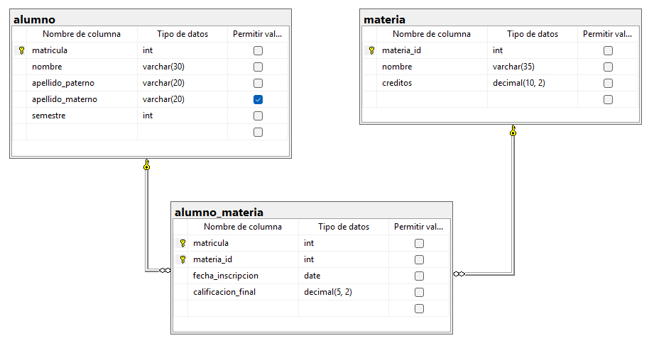

## Ejercicio 3
### Código
```sql
-- Crea la base de datos
CREATE DATABASE escuela;
GO

-- Usa la base de datos
USE escuela;
GO

-- Crea la tabla alumno
CREATE TABLE alumno(
	matricula INT NOT NULL IDENTITY(25300600, 1),
	nombre VARCHAR(30) NOT NULL,
	apellido_paterno VARCHAR(20) NOT NULL,
	apellido_materno VARCHAR(20) NULL,
	semestre INT NOT NULL,
	CONSTRAINT pk_alumno PRIMARY KEY (matricula),
	CONSTRAINT ck_alumno_semestre CHECK(semestre BETWEEN 1 AND 6)
);
GO

-- Crea la tabla materia
CREATE TABLE materia(
	materia_id INT NOT NULL IDENTITY(1, 1),
	nombre VARCHAR(35) NOT NULL,
	creditos DECIMAL(10, 2) NOT NULL,
	CONSTRAINT pk_materia PRIMARY KEY (materia_id),
	CONSTRAINT ck_materia_creditos CHECK(creditos > 0.0)
);
GO

-- Crea la tabla alumno_materia
CREATE TABLE alumno_materia(
	matricula INT NOT NULL,
	materia_id INT NOT NULL,
	fecha_inscripcion DATE NOT NULL CONSTRAINT df_alumno_materia_fecha_inscripcion DEFAULT GETDATE(),
	calificacion_final DECIMAL(5, 2) NOT NULL,
	CONSTRAINT pk_detalle_pedido PRIMARY KEY (matricula, materia_id),
	CONSTRAINT ck_alumno_materia_calificacion CHECK(calificacion_final > 0.0 AND calificacion_final <= 10.0),
	CONSTRAINT fk_alumno_materia_alumno FOREIGN KEY (matricula) REFERENCES alumno(matricula),
	CONSTRAINT fk_alumno_materia_materia FOREIGN KEY (materia_id) REFERENCES materia(materia_id)
);
GO
```

### Diagrama 3
