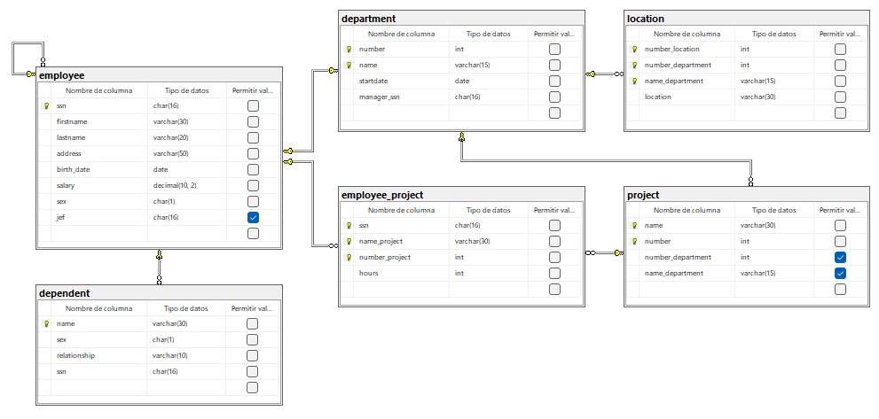

## Ejercicio 5
### Código
```sql
-- Crea la base de datos
CREATE DATABASE enterprise;
GO

-- Usa la base de datos
USE enterprise;
GO

-- Crea la tabla employee
CREATE TABLE employee(
	ssn CHAR(16) NOT NULL,
	firstname VARCHAR(30) NOT NULL,
	lastname VARCHAR(20) NOT NULL,
	address VARCHAR(50) NOT NULL,
	birth_date DATE NOT NULL,
	salary DECIMAL(10, 2) NOT NULL,
	sex CHAR(1) NOT NULL,
	jef CHAR(16),
	CONSTRAINT pk_employee PRIMARY KEY (ssn),
	CONSTRAINT ck_employee_salary CHECK(salary > 0.0),
	CONSTRAINT ck_employee_sex CHECK(sex IN ('M', 'F')),
	CONSTRAINT fk_employee_employee FOREIGN KEY (jef) REFERENCES employee(ssn)
);
GO

-- Crea la tabla dependent
CREATE TABLE dependent(
	name VARCHAR(30) NOT NULL,
	sex CHAR(1) NOT NULL,
	relationship VARCHAR(10) NOT NULL,
	ssn CHAR(16) NOT NULL,
	CONSTRAINT pk_dependent PRIMARY KEY (name),
	CONSTRAINT ck_dependent_sex CHECK(sex IN ('M', 'F')),
	CONSTRAINT ck_dependent_relationship CHECK(relationship IN ('wife', 'husband', 'son', 'daughter', 'grandparent')),
	CONSTRAINT fk_dependent_employee FOREIGN KEY (ssn) REFERENCES employee(ssn)
);
GO

-- Crea la tabla department
CREATE TABLE department(
	number INT NOT NULL IDENTITY(1, 1),
	name VARCHAR(15) NOT NULL,
	startdate DATE NOT NULL CONSTRAINT df_department_startdate DEFAULT GETDATE(),
	manager_ssn CHAR(16) NOT NULL
	CONSTRAINT pk_department PRIMARY KEY (number, name),
	CONSTRAINT uq_department_name UNIQUE (name),
	CONSTRAINT uq_department_manager_ssn UNIQUE (manager_ssn),
	CONSTRAINT fk_department_employee FOREIGN KEY (manager_ssn) REFERENCES employee(ssn)
);
GO

-- Crea la tabla location
CREATE TABLE location(
	number_location INT NOT NULL IDENTITY(1, 1),
	number_department INT NOT NULL,
	name_department VARCHAR(15) NOT NULL,
	location VARCHAR(30) NOT NULL,
	CONSTRAINT pk_location PRIMARY KEY (number_location, number_department, name_department),
	CONSTRAINT fk_location_department FOREIGN KEY (number_department, name_department) REFERENCES department(number, name),
	CONSTRAINT uq_location_location UNIQUE (location)
);
GO

-- Crea la tabla project
CREATE TABLE project(
	name VARCHAR(30) NOT NULL,
	number INT NOT NULL IDENTITY(1, 1),
	number_department INT NULL,
	name_department VARCHAR(15) NULL,
	CONSTRAINT pk_project PRIMARY KEY (name, number),
	CONSTRAINT fk_project_department FOREIGN KEY (number_department, name_department) REFERENCES department(number, name)
);
GO

-- Crea la tabla employee_project
CREATE TABLE employee_project(
	ssn CHAR(16) NOT NULL,
	name_project VARCHAR(30) NOT NULL,
	number_project INT NOT NULL,
	hours INT NOT NULL,
	CONSTRAINT pk_employee_project PRIMARY KEY (ssn, name_project, number_project),
	CONSTRAINT fk_employee_project_employee FOREIGN KEY (ssn) REFERENCES employee(ssn),
	CONSTRAINT fk_employee_project_project FOREIGN KEY (name_project, number_project) REFERENCES project(name, number)
);
GO
```

### Diagrama 5
