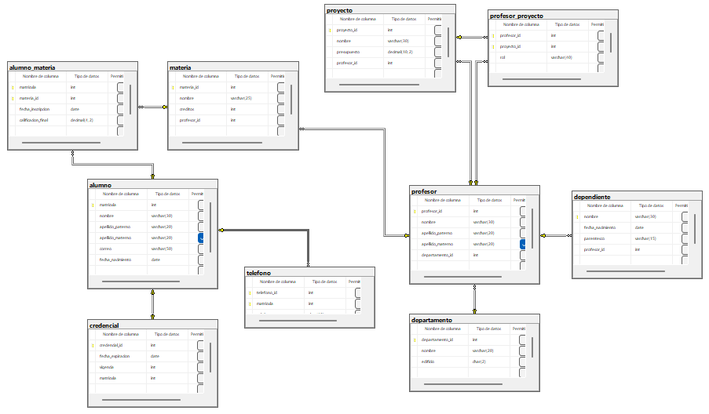

## Ejercicio 7
### Código
```sql
-- Crea la base de datos
CREATE DATABASE sistema_administracion_universidades;
GO

-- Usa la base de datos
USE sistema_administracion_universidades;
GO

-- Crea la tabla alumno
CREATE TABLE alumno(
	matricula INT NOT NULL IDENTITY(25300000, 1),
	nombre VARCHAR(30) NOT NULL,
	apellido_paterno VARCHAR(20) NOT NULL,
	apellido_materno VARCHAR(20) NULL,
	correo VARCHAR(50) NOT NULL,
	fecha_nacimiento DATE NOT NULL,
	CONSTRAINT pk_alumno PRIMARY KEY (matricula),
	CONSTRAINT uq_alumno_correo UNIQUE (correo)
);
GO

-- Crea la tabla telefono
CREATE TABLE telefono(
	telefono_id INT NOT NULL,
	matricula INT NOT NULL,
	telefono CHAR(10) NOT NULL,
	CONSTRAINT pk_telefono PRIMARY KEY (telefono_id, matricula),
	CONSTRAINT uq_telefono_telefono UNIQUE (telefono),
	CONSTRAINT fk_telefono_alumno FOREIGN KEY (matricula) REFERENCES alumno(matricula)
);
GO

-- Crea la tabla credencial
CREATE TABLE credencial(
	credencial_id INT NOT NULL IDENTITY(1, 1),
	fecha_expiracion DATE NOT NULL,
	vigencia INT NOT NULL,
	matricula INT NOT NULL,
	CONSTRAINT pk_credencial PRIMARY KEY (credencial_id),
	CONSTRAINT uq_credencial_matricula UNIQUE (matricula),
	CONSTRAINT fk_credencial_alumno FOREIGN KEY (matricula) REFERENCES alumno(matricula)
);
GO

-- Crea la tabla materia
CREATE TABLE materia(
	materia_id INT NOT NULL IDENTITY(1, 1),
	nombre VARCHAR(25) NOT NULL,
	creditos INT NOT NULL,
	profesor_id INT NOT NULL,
	CONSTRAINT pk_materia PRIMARY KEY (materia_id),
	CONSTRAINT uq_materia_nombre UNIQUE (nombre),
);
GO

ALTER TABLE materia
ADD CONSTRAINT fk_materia_profesor FOREIGN KEY (profesor_id) REFERENCES profesor(profesor_id)
GO

-- Crea la tabla alumno_materia
CREATE TABLE alumno_materia(
	matricula INT NOT NULL,
	materia_id INT NOT NULL,
	fecha_inscripcion DATE NOT NULL CONSTRAINT df_alumno_materia_fecha_inscripcion DEFAULT GETDATE(),
	calificacion_final DECIMAL(4, 2) NOT NULL,
	CONSTRAINT pk_alumno_materia PRIMARY KEY (matricula, materia_id),
	CONSTRAINT ck_alumno_materia_calificacion_final CHECK(calificacion_final BETWEEN 0.0 AND 10.0),
	CONSTRAINT fk_alumno_materia_alumno FOREIGN KEY (matricula) REFERENCES alumno(matricula),
	CONSTRAINT fk_alumno_materia_materia FOREIGN KEY (materia_id) REFERENCES materia(materia_id)
);
GO

-- Crea la tabla profesor
CREATE TABLE profesor(
	profesor_id INT NOT NULL IDENTITY(1, 1),
	nombre VARCHAR(30) NOT NULL,
	apellido_paterno VARCHAR(20) NOT NULL,
	apellido_materno VARCHAR(20) NULL,
	departamento_id INT NOT NULL,
	CONSTRAINT pk_profesor PRIMARY KEY (profesor_id),
);
GO

ALTER TABLE profesor
ADD CONSTRAINT fk_profesor_departamento FOREIGN KEY (departamento_id) REFERENCES departamento(departamento_id)
GO

-- Crea la tabla departamento
CREATE TABLE departamento(
	departamento_id INT NOT NULL IDENTITY(1, 1),
	nombre VARCHAR(20) NOT NULL,
	edificio CHAR(2) NOT NULL,
	CONSTRAINT pk_departamento PRIMARY KEY (departamento_id),
	CONSTRAINT uq_departamento_nombre UNIQUE (nombre),
	CONSTRAINT ck_departamento_edificio CHECK(edificio LIKE '[a-zA-Z][0-9]')
);
GO

-- Crea la tabla dependiente
CREATE TABLE dependiente(
	nombre VARCHAR(30) NOT NULL,
	fecha_nacimiento DATE NOT NULL,
	parentesco VARCHAR(15) NOT NULL,
	profesor_id INT NOT NULL,
	CONSTRAINT pk_dependiente PRIMARY KEY (nombre),
	CONSTRAINT ck_dependiente_parentesco CHECK(parentesco IN ('esposo', 'esposa', 'hijo/a', 'padre/madre')),
	CONSTRAINT fk_dependiente_profesor FOREIGN KEY (profesor_id) REFERENCES profesor(profesor_id)
);
GO

-- Crea la tabla proyecto
CREATE TABLE proyecto(
	proyecto_id INT NOT NULL IDENTITY(1, 1),
	nombre VARCHAR(30) NOT NULL,
	presupuesto DECIMAL(10, 2) NOT NULL,
	profesor_id INT NOT NULL,
	CONSTRAINT pk_proyecto PRIMARY KEY (proyecto_id),
	CONSTRAINT ck_proyecto_presupuesto CHECK(presupuesto > 0.0),
	CONSTRAINT fk_proyecto_profesor FOREIGN KEY (profesor_id) REFERENCES profesor(profesor_id)
);
GO

-- Crea la tabla profesor_proyecto
CREATE TABLE profesor_proyecto(
	profesor_id INT NOT NULL,
	proyecto_id INT NOT NULL,
	rol VARCHAR(40) NOT NULL,
	CONSTRAINT pk_profesor_proyecto PRIMARY KEY (profesor_id, proyecto_id),
	CONSTRAINT fk_profesor_proyecto_profesor FOREIGN KEY (profesor_id) REFERENCES profesor(profesor_id),
	CONSTRAINT fk_profesor_proyecto_proyecto FOREIGN KEY (proyecto_id) REFERENCES proyecto(proyecto_id)
);
GO
```

### Diagrama 7
