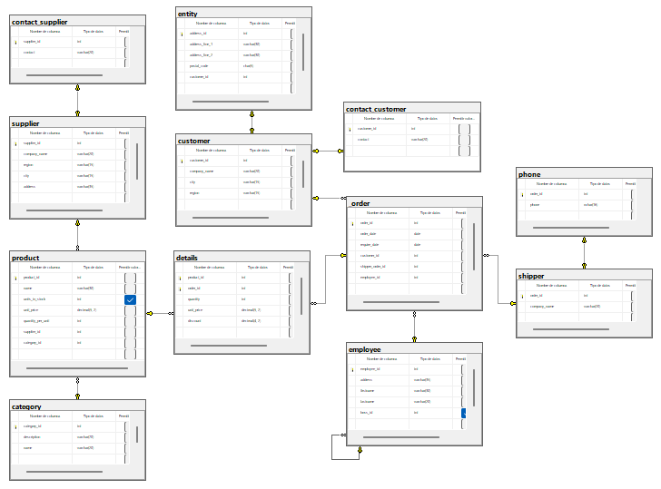

## Ejercicio 9
### Código
```sql
-- Crea la base de datos
CREATE DATABASE products_orders;
GO

-- Usa la base de datos
USE products_orders;
GO

-- Crea la tabla supplier
CREATE TABLE supplier(
	supplier_id INT NOT NULL IDENTITY(1, 1),
	company_name VARCHAR(20) NOT NULL,
	region VARCHAR(15) NOT NULL,
	city VARCHAR(15) NOT NULL,
	address VARCHAR(35) NOT NULL,
	CONSTRAINT pk_supplier PRIMARY KEY (supplier_id),
	CONSTRAINT uq_supplier_company_name UNIQUE (company_name)
);
GO

-- Crea la tabla contact_supplier
CREATE TABLE contact_supplier(
	supplier_id INT NOT NULL,
	contact VARCHAR(20) NOT NULL,
	CONSTRAINT pk_contact_supplier PRIMARY KEY (supplier_id),
	CONSTRAINT fk_contact_supplier_supplier FOREIGN KEY (supplier_id) REFERENCES supplier(supplier_id)
);
GO

-- Crea la tabla category
CREATE TABLE category(
	category_id INT NOT NULL IDENTITY(1, 1),
	description VARCHAR(70) NOT NULL,
	name VARCHAR(20) NOT NULL,
	CONSTRAINT pk_category PRIMARY KEY (category_id),
	CONSTRAINT uq_category_name UNIQUE (name)
);
GO

-- Crea la tabla product
CREATE TABLE product(
	product_id INT NOT NULL IDENTITY(1, 1) CONSTRAINT pk_product PRIMARY KEY,
	name VARCHAR(30) NOT NULL CONSTRAINT uq_product_name UNIQUE,
	units_in_stock INT NULL,
	unit_price DECIMAL(5, 2) NOT NULL CONSTRAINT ck_product_unit_price CHECK(unit_price > 0.0),
	quantity_per_unit INT NOT NULL CONSTRAINT ck_product_quantity_per_unit CHECK(quantity_per_unit > 0),
	supplier_id INT NOT NULL CONSTRAINT fk_product_supplier FOREIGN KEY REFERENCES supplier(supplier_id),
	category_id INT NOT NULL CONSTRAINT fk_product_category FOREIGN KEY REFERENCES category(category_id)
);
GO

-- Crea la tabla customer
CREATE TABLE customer(
	customer_id INT NOT NULL IDENTITY(1, 1),
	company_name VARCHAR(20) NOT NULL,
	city VARCHAR(15) NOT NULL,
	region VARCHAR(15) NOT NULL,
	CONSTRAINT pk_customer PRIMARY KEY (customer_id)
);

-- Crea la tabla contact_customer
CREATE TABLE contact_customer(
	customer_id INT NOT NULL,
	contact VARCHAR(20) NOT NULL,
	CONSTRAINT pk_contact_customer PRIMARY KEY (customer_id),
	CONSTRAINT fk_contact_customer_customer FOREIGN KEY (customer_id) REFERENCES customer(customer_id)
);
GO

-- Crea la tabla entity
CREATE TABLE entity(
	address_id INT NOT NULL IDENTITY(1, 1),
	address_line_1 VARCHAR(30) NOT NULL,
	address_line_2 VARCHAR(30) NOT NULL,
	postal_code CHAR(5) NOT NULL,
	customer_id INT NOT NULL,
	CONSTRAINT pk_entity PRIMARY KEY (address_id),
	CONSTRAINT ck_postal_code CHECK(postal_code LIKE '[0-9]{5}'),
	CONSTRAINT uq_customer_id UNIQUE (customer_id),
	CONSTRAINT fk_entity_customer FOREIGN KEY (customer_id) REFERENCES customer(customer_id)
);
GO

-- Crea la tabla employee
CREATE TABLE employee(
	employee_id INT NOT NULL IDENTITY(1, 1),
	address VARCHAR(35) NOT NULL,
	firstname VARCHAR(30) NOT NULL,
	lastname VARCHAR(20) NOT NULL,
	boss_id INT NULL,
	CONSTRAINT pk_employee PRIMARY KEY (employee_id),
	CONSTRAINT fk_employee_employee FOREIGN KEY (boss_id) REFERENCES employee(employee_id)
);
GO

-- Crea la tabla shipper
CREATE TABLE shipper(
	order_id INT NOT NULL IDENTITY(1, 1),
	company_name VARCHAR(20) NOT NULL,
	CONSTRAINT pk_shipper PRIMARY KEY (order_id)
);
GO

-- Crea la tabla phone
CREATE TABLE phone(
	order_id INT NOT NULL,
	phone NCHAR(16) NOT NULL,
	CONSTRAINT pk_phone PRIMARY KEY (order_id),
	CONSTRAINT fk_phone_shipper FOREIGN KEY (order_id) REFERENCES shipper(order_id),
	CONSTRAINT ck_phone_phone CHECK(phone LIKE '\+\d{2}-\d{3}-\d{3}-\d{4}')
);
GO

-- Crea la tabla orders
CREATE TABLE _order(
	order_id INT NOT NULL IDENTITY(1, 1),
	order_date DATE NOT NULL CONSTRAINT df_order_order_date DEFAULT GETDATE(),
	require_date DATE NOT NULL CONSTRAINT df_order_require_date DEFAULT GETDATE(),
	customer_id INT NOT NULL,
	shipper_order_id INT NOT NULL,
	employee_id INT NOT NULL,
	CONSTRAINT pk_order PRIMARY KEY (order_id),
	CONSTRAINT fk_order_customer FOREIGN KEY (customer_id) REFERENCES customer(customer_id),
	CONSTRAINT fk_order_shipper FOREIGN KEY (shipper_order_id) REFERENCES shipper(order_id),
	CONSTRAINT fk_order_employee FOREIGN KEY (employee_id) REFERENCES employee(employee_id)
);
GO

-- Crea la tabla details
CREATE TABLE details(
	product_id INT NOT NULL,
	order_id INT NOT NULL,
	quantity INT NOT NULL,
	unit_price DECIMAL(5, 2) NOT NULL,
	discount DECIMAL(4, 2) NOT NULL,
	CONSTRAINT pk_details PRIMARY KEY (product_id, order_id),
	CONSTRAINT ck_details_quantity CHECK(quantity > 0),
	CONSTRAINT ck_details_unit_price CHECK(unit_price > 0.0),
	CONSTRAINT ck_details_discount CHECK(discount > 0.0),
	CONSTRAINT fk_details_product FOREIGN KEY (product_id) REFERENCES product(product_id),
	CONSTRAINT fk_details_order FOREIGN KEY (order_id) REFERENCES _order(order_id)
);
GO
```

### Diagrama 9
